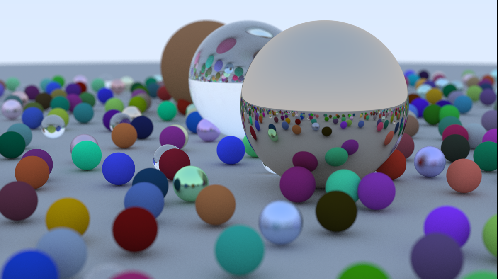

# Ray Tracing
### Implementation for classes that allow to render scenes with realistic lighting and materials



## How to use
to render the image the same as 18-defocus-blur.ppm in ./images folder you can run
``` lang="bash"
cmake --build build && build/ray_tracing > image.ppm
```

Image will be written to the file image.ppm in directory of the project

##### followed by ray tracing in one weekend